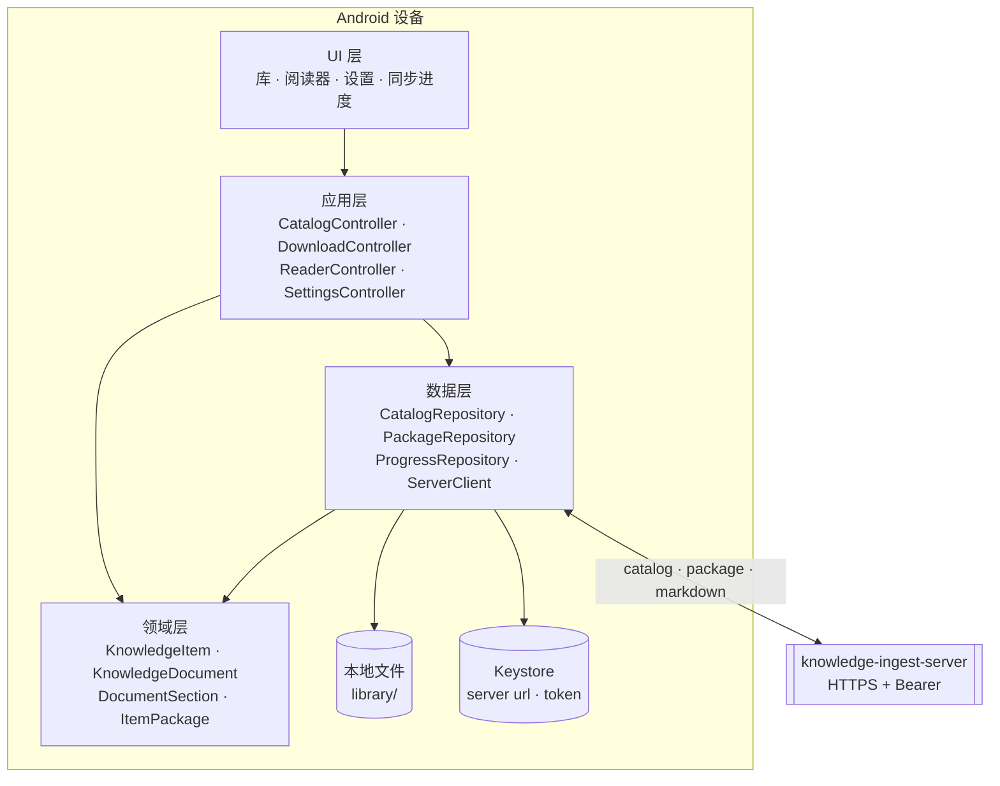
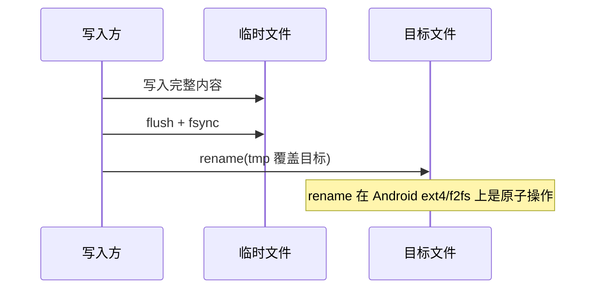
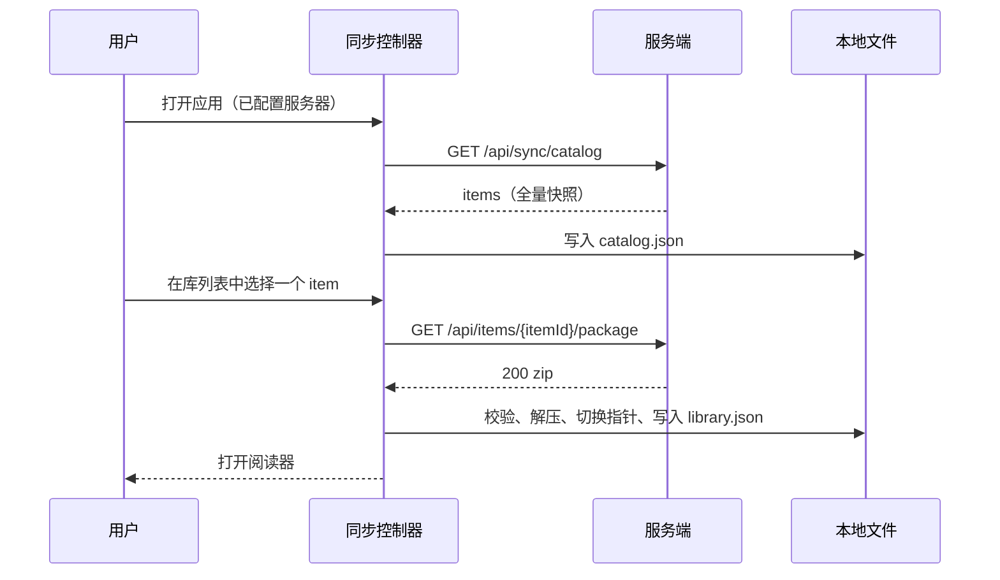
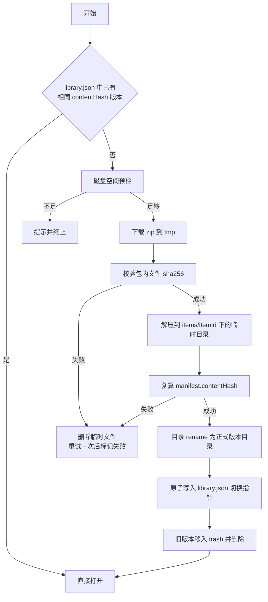

# Knowledge Reader Android 客户端技术方案

## 文档信息

| 项目         | 内容                                                                        |
| ------------ | --------------------------------------------------------------------------- |
| **文档标题** | Knowledge Reader Android 客户端技术方案                                     |
| **文档版本** | v1.0                                                                        |
| **创建日期** | 2026-09-01                                                                  |
| **更新日期** | 2026-09-12                                                                  |
| **文档作者** | convexwf                                                                    |
| **文档类型** | 技术设计                                                                    |
| **参考资料** | `rendering-layer.md`、`knowledge-suite` 仓库的 `knowledge-ingest-server` 源码 |

## 目录

- [1 目标与范围](#1-目标与范围)
  - [1.1 目标](#11-目标)
  - [1.2 非目标](#12-非目标)
- [2 系统上下文](#2-系统上下文)
  - [2.1 服务端现状](#21-服务端现状)
  - [2.2 服务端 API 现状](#22-服务端-api-现状)
  - [2.3 本地联调](#23-本地联调)
- [3 总体架构](#3-总体架构)
  - [3.1 分层](#31-分层)
  - [3.2 源码目录结构](#32-源码目录结构)
  - [3.3 技术选型](#33-技术选型)
- [4 领域模型](#4-领域模型)
- [5 本地存储](#5-本地存储)
  - [5.1 存储布局](#51-存储布局)
  - [5.2 本地状态文件](#52-本地状态文件)
  - [5.3 写入与原子性](#53-写入与原子性)
  - [5.4 是否使用本地数据库](#54-是否使用本地数据库)
  - [5.5 容量管理与回收](#55-容量管理与回收)
- [6 离线包契约](#6-离线包契约)
  - [6.1 contentHash 定义](#61-contenthash-定义)
  - [6.2 包结构](#62-包结构)
  - [6.3 manifest.json 字段](#63-manifestjson-字段)
  - [6.4 目录快照端点](#64-目录快照端点)
  - [6.5 包下载端点](#65-包下载端点)
- [7 同步流程](#7-同步流程)
  - [7.1 首次同步](#71-首次同步)
  - [7.2 单 item 下载与替换](#72-单-item-下载与替换)
  - [7.3 内容更新](#73-内容更新)
- [8 网络层](#8-网络层)
- [9 状态管理与界面](#9-状态管理与界面)
  - [9.1 状态管理](#91-状态管理)
  - [9.2 路由](#92-路由)
  - [9.3 界面结构](#93-界面结构)
- [10 阅读进度](#10-阅读进度)
- [11 错误与边界](#11-错误与边界)
- [12 性能](#12-性能)
- [13 安全](#13-安全)
- [14 测试策略](#14-测试策略)
- [15 里程碑与验收](#15-里程碑与验收)
- [16 待决问题](#16-待决问题)
- [附录 A 领域字段速查](#附录-a-领域字段速查)

## 1 目标与范围

### 1.1 目标

Knowledge Reader 是 `knowledge-suite` 的 Android 阅读客户端。它把服务端已抓取、已解析的内容以原生界面呈现，并保证在没有网络时仍然可读。

- 原生渲染：正文由 Flutter widget 渲染，不使用 WebView。渲染规则见 `rendering-layer.md`。
- 离线优先：目录（catalog）在线获取，内容按 item 下载到本地，下载完成后完全离线可读。
- 原子更新：任意时刻中断下载、解压或替换，都不会留下半新半旧的文档内容。
- 可预期阅读体验：字号、行距、主题、目录跳转、进度恢复由客户端控制，不受服务端渲染结果影响。

### 1.2 非目标

以下能力明确不在 v1 范围内，架构上不为其预留额外复杂度，但也不做阻塞性设计。

- 不做网页剪藏（clipper）：`/api/ingest/*`、`/api/batch/*`、`/api/import/*` 等写入端点不在客户端调用范围内。
- 不做 AI 摘要：`/api/tasks/:taskId` 系列不接入。
- 不做注解：高亮、笔记、书签、标签的读写不接入。
- 不做多设备进度同步：进度只落在本机，服务端不存进度。
- 不做离线全文检索：v1 的搜索只走在线 `/api/search`。
- 不做增量同步：目录同步只采用全量快照加 `ETag`，不引入游标、变更时间参数与删除墓碑，理由见第 6.4 节。
- iOS、桌面端不作为 v1 交付目标。代码保持平台无关，但不为其做构建验证。

## 2 系统上下文

### 2.1 服务端现状

服务端是 `knowledge-suite` 仓库的 `apps/knowledge-ingest-server`，Fastify + SQLite(FTS)，以 Docker 镜像部署在云服务器上。

| 项目     | 事实                                                                       |
| -------- | -------------------------------------------------------------------------- |
| 协议     | HTTP(S)，客户端按 HTTPS 配置                                                |
| 端口     | 默认 `18765`                                                                |
| 鉴权     | `Authorization: Bearer <token>`，`/api/health` 免鉴权                       |
| 数据模型 | 一个 item 关联一个 active RawDoc 与一个 active Document（sections 结构）     |
| 资源     | 文档图片以 `assets/<assetId>` 引用，服务端经 `/api/assets/:assetId` 提供字节 |

### 2.2 服务端 API 现状

客户端 v1 依赖的读侧端点：

| 端点                                                   | 用途                       | v1 依赖方式            |
| ------------------------------------------------------ | -------------------------- | ---------------------- |
| `GET /api/health`                                      | 连通性与版本探测（免鉴权）  | 配置校验               |
| `GET /api/items?sourceType=&limit=`                    | item 列表，`limit` 上限 500 | 在线兜底与首次探索     |
| `GET /api/items/:itemId`                               | item + document + rawdoc    | 在线直读兜底           |
| `GET /api/documents/:docId`                            | 文档 JSON（sections）       | 在线直读兜底           |
| `GET /api/documents/:docId/markdown`                   | Markdown（复制/分享）       | 分享功能               |
| `GET /api/assets/:assetId`                             | 图片字节                    | 未下载资源时的在线兜底 |
| `GET /api/items/:itemId/github-asset/:assetRef`         | 私有仓库图片代理            | 在线兜底               |
| `GET /api/collections`                                 | 集合列表（批量抓取的文档集） | 后续版本               |
| `GET /api/collections/:collectionId`                   | 集合详情（含 `orderIndex`）  | 后续版本               |
| `GET /api/collections/:collectionId/navigation?itemId=` | 集合内上一项/下一项          | 后续版本               |

集合（collection）与书籍是两个不同概念，阅读器需要分别处理：

| 概念     | 产生方式                                                       | 阅读顺序                                   |
| -------- | -------------------------------------------------------------- | ------------------------------------------ |
| 集合     | 批量抓取任务（`POST /api/batch/jobs`）把一批同源页面组成一个集合 | 集合内按 `orderIndex` 排序，`depth` 表示抓取深度 |
| EPUB 书籍 | `POST /api/import/epub` 导入一本 EPUB 生成一个 item 与一个 document | 书内按 `sections` 中的 heading 顺序，属于文档内导航 |

EPUB 不会形成集合：一整本书是一个 item，章节是同一文档中的 section。因此书内翻章靠文档内章节导航，集合导航只用于批量抓取产生的文档集。
| `GET /api/search?q=`                                   | 在线全文检索                | 在线搜索               |

客户端需要的两个新端点（见第 6 章）：

| 端点                             | 用途                       |
| -------------------------------- | -------------------------- |
| `GET /api/sync/catalog`          | 目录快照（含内容指纹）      |
| `GET /api/items/:itemId/package` | 单 item 离线包（zip）       |

### 2.3 本地联调

开发期把模拟器或真机指向本机的 knowledge-ingest-server：

```bash
# 把设备的 18765 端口转发到宿主机的 18765（容器只发布在宿主 127.0.0.1 上）
adb reverse tcp:18765 tcp:18765
```

随后在应用设置页填写 `http://127.0.0.1:18765` 与令牌。明文 HTTP 只对 debug 构建开放：`android/app/src/debug/AndroidManifest.xml` 里设置 `android:usesCleartextTraffic="true"`，release 构建不含该属性，因此仍强制 HTTPS。

端到端测试直接跑在设备上：

```bash
flutter test integration_test/app_test.dart -d <device-id>
```

该测试默认访问 `http://127.0.0.1:18765`（依赖上面的 adb reverse），可用 `--dart-define=SERVER_BASE_URL=https://your-server` 覆盖；服务端不可达时测试自我跳过。

注意：`flutter test integration_test/...` 编译出的 APK 入口是测试监听器（`flutter_test_listener.dart`），单独安装启动会停在启动画面等待 VM service，不能当普通应用运行。手动体验请用 `flutter run -d <device>` 或先 `flutter build apk --debug` 再安装，不要把集成测试产出的 APK 当作可运行包。

调试构建可以内置服务器配置，安装后无需手工填写：

```bash
flutter build apk --debug \
  --dart-define=SERVER_BASE_URL=http://127.0.0.1:18765 \
  --dart-define=SERVER_TOKEN=dev-token
```

`SERVER_BASE_URL` 非空且本地尚无配置时，应用会在首次启动把这两个值写入安全存储；已有配置仍然优先，用户之后在设置页的修改不会被覆盖。仅在本地调试构建中使用该方式，发布构建不要内置令牌。

现有 `/api/items` 不足以支撑离线同步：它只有 `limit`（≤500），响应里没有内容指纹与包大小，客户端无法判断本地副本是否过期。因此需要新增一个目录快照端点，返回紧凑且字段稳定的元数据集合。

## 3 总体架构

### 3.1 分层

客户端采用四层结构：UI 层只消费状态，应用层封装用例与调度，领域层定义模型，数据层负责远程与本地实现。



各层职责：

| 层     | 职责                                                                     | 不做什么                   |
| ------ | ------------------------------------------------------------------------ | -------------------------- |
| UI     | 渲染 widget、接收手势、展示状态与错误                                     | 不直接发请求、不读写文件   |
| 应用层 | 编排用例（同步、下载、打开文档）、持有状态、调度并发与重试                 | 不关心 HTTP 细节与文件路径 |
| 领域层 | 纯 Dart 模型与规则（章节树、进度换算、内联解析入口）                      | 不依赖 Flutter 之外的 IO   |
| 数据层 | HTTP 客户端、文件系统布局、原子写、包校验与解压、本地索引                  | 不做界面决策               |

### 3.2 源码目录结构

```
knowledge-reader-flutter/
├── doc/
│   ├── android-reader-design.md      # 本文件
│   └── rendering-layer.md            # 渲染层实现说明
└── knowledge_reader/
    ├── lib/
    │   ├── main.dart                  # 入口：初始化容器与路由
    │   ├── app/                       # 应用装配、主题、路由表
    │   ├── core/                      # 结果类型、错误模型、日志、JSON 工具
    │   ├── domain/
    │   │   ├── model/                 # KnowledgeItem、KnowledgeDocument、DocumentSection
    │   │   └── rule/                  # 章节树、进度换算、内联语法（纯函数）
    │   ├── data/
    │   │   ├── remote/                # ServerClient、端点封装、DTO 与映射
    │   │   └── local/                 # 文件布局、原子写、包校验、解压、索引
    │   ├── application/               # Controller 与 Provider 定义
    │   └── features/
    │       ├── library/               # 库列表
    │       ├── reader/                # 阅读页与渲染层
    │       ├── settings/              # 服务器配置
    │       └── sync/                  # 同步与下载进度
    └── test/
        ├── fixtures/inline/           # 与 web 端共享的内联语料
        └── ...
```

### 3.3 技术选型

版本为 2026-09-12 在 pub.dev 核对的当前版本，实际写入 `pubspec.yaml` 时以 `flutter pub add` 的结果为准。

| 关注点   | 选择                         | 版本          | 依据                                                     |
| -------- | ---------------------------- | ------------- | -------------------------------------------------------- |
| SDK      | Flutter stable / Dart        | 3.47.4 / 3.13.3 | 与本机既有 SDK 一致                                    |
| 状态管理 | `flutter_riverpod`           | 3.4.3         | 编译期安全、易测试，无需 BuildContext 即可组合异步状态    |
| 路由     | `go_router`                  | 18.0.1        | 声明式路由，深链（外链回跳、通知打开文档）后续可复用      |
| HTTP     | `dio`                        | 5.11.1        | 拦截器、超时、下载进度、Range 预留                        |
| 安全存储 | `flutter_secure_storage`     | 11.1.1        | token 存 Android Keystore                                |
| 本地路径 | `path_provider` + `path`     | 2.1.6 / 1.9.1 | 应用私有目录定位与路径拼接                               |
| 压缩包   | `archive`                    | 4.2.0         | zip 解压，配合路径校验实现安全解包                        |
| 哈希     | `crypto`                     | 3.0.7         | 与契约一致的 SHA-256                                     |
| 序列化   | `json_serializable`          | 6.14.1        | 字段映射代码生成，避免手写映射漂移                        |
| 不变模型 | `freezed`（可选）            | 4.0.1         | 不可变与 `copyWith`；若模板膨胀可改用纯 final 类          |
| 列表跳转 | `scrollable_positioned_list`  | 0.3.8         | 目录按 index 跳转到任意 section                          |
| 外链     | `url_launcher`               | 6.3.2         | 打开外部浏览器与邮件                                     |
| 测试     | `flutter_test` + `mocktail`  | —             | 单元与 widget 测试                                       |

明确不引入：

| 不引入             | 原因                                                           |
| ------------------ | -------------------------------------------------------------- |
| `flutter_markdown` | 已在 pub.dev 标记 DISCONTINUED，且渲染模型与本方案不一致        |
| 任何 WebView 方案  | 与原生渲染目标冲突，滚动与手势体验不可控                        |
| `flutter_html`     | 输入不是 HTML，引入只会增加无用解析路径                         |

## 4 领域模型

领域模型与服务端 `packages/knowledge-schema` 一一对应，字段名保持与 wire 格式一致（snake_case），避免映射层产生歧义。完整字段见[附录 A](#附录-a-领域字段速查)。

| 模型                | 说明                                                        |
| ------------------- | ----------------------------------------------------------- |
| `KnowledgeItem`     | 一个可阅读条目：标题、来源、状态、activeDocId、tags          |
| `KnowledgeDocument` | 文档主体：meta 与 sections                                   |
| `DocumentSection`   | 内容块：heading/paragraph/blockquote/list/table/code/figure   |
| `ItemPackage`       | 本地离线包描述：contentHash、文件清单、解压目录               |
| `CollectionSummary` | 集合摘要（批量抓取的文档集），后续版本使用                     |

模型来源有两个：在线拉取的 JSON（`/api/items/:itemId`、`/api/documents/:docId`）与离线包内的 `document.json`。二者结构相同，客户端只实现一套解析路径，不允许出现在线模型与离线模型两套字段。

## 5 本地存储

### 5.1 存储布局

内容根目录使用 `getApplicationSupportDirectory()`（应用私有，系统清理缓存时不会被回收），下载与解压的临时区使用 `getTemporaryDirectory()`。

```
<appSupport>/library/
├── catalog.json                  # 服务端目录快照缓存（可重建）
├── library.json                  # 已下载 item 与版本指针（可重建）
├── progress.json                 # 阅读进度（丢失可接受）
└── items/
    └── <itemId>/
        ├── <contentHash>/        # 解压后的不可变内容目录
        │   ├── manifest.json
        │   ├── document.json
        │   ├── markdown.md
        │   └── assets/<assetId>
        └── ...

<cache>/library/
├── tmp/                          # 下载中的 zip（启动时清空）
└── trash/                        # 待回收的旧版本目录（启动时删除）
```

内容目录以 `contentHash` 命名且写入后不再修改，因此每次更新都是"新增目录 + 切换指针"，而不是原地覆盖。

### 5.2 本地状态文件

| 文件            | 内容                                                                     | 权威性                             |
| --------------- | ------------------------------------------------------------------------ | ---------------------------------- |
| `catalog.json`  | 服务端目录快照：item 元数据 + contentHash + 包大小 + 快照时间              | 服务端权威，可随时重建              |
| `library.json`  | 每个 item 的本地状态：已下载的 contentHash、解压路径、下载时间、占用空间    | 本地权威，可扫描 `items/` 重建      |
| `progress.json` | 每个 item 的最后阅读位置：sectionId、section 内偏移、更新时间              | 本地权威，丢失只影响阅读位置        |

三份文件都只保存可重建的信息，这是第 5.4 节结论成立的前提。文件统一带 `schemaVersion` 字段；版本不匹配时按可重建策略处理：`catalog.json` 直接丢弃重拉，`library.json` 扫描目录重建，`progress.json` 丢弃重建。

### 5.3 写入与原子性

所有 JSON 状态文件都采用"临时文件 + 重命名"写入，保证任何时刻进程被杀都不会读到半截文件。



写入频率上做区分：`progress.json` 在阅读过程中可能频繁更新，因此按时间节流写入（停止滚动 2 秒后，或每 10 秒一次），避免频繁 IO 与耗电。

### 5.4 是否使用本地数据库

结论：v1 不引入数据库。本地只保存三类小对象与一类 blob，查询需求接近零，而文件系统语义与"整包替换"天然吻合。

| 方案                          | 优点                                                           | 缺点                                                   | 结论   |
| ----------------------------- | -------------------------------------------------------------- | ------------------------------------------------------ | ------ |
| 文件系统 + JSON 索引           | 无需 schema 迁移；与 zip 包对应直观；原子 rename 即可切换版本；可重建 | 需自行处理并发与写入原子性；没有查询能力                | 采用   |
| SQLite（`drift` / `sqlite3`）  | 支持 FTS5、事务、复杂查询；与服务端同构，未来可复用 FTS 结构       | 需要迁移管理；blob 仍要落文件；为当前需求引入额外复杂度   | 推迟   |
| 键值库（`hive_ce` 等）         | 上手快                                                          | 同样没有查询能力，且与文件型内容分叉成两套存储           | 不采用 |

升级到 SQLite 的触发条件（满足任意一条即重新评估）：

1. 需要离线全文检索。服务端本身用 SQLite FTS 建索引，离线包可以直接携带该文档的 FTS 片段，客户端查询逻辑与服务端同构。
2. 目录规模增长到数千 item，且需要在本地做排序、过滤、分页。
3. 需要注解、进度等数据的多表事务一致性，或需要记录更细粒度的逐条同步状态。

### 5.5 容量管理与回收

- 配额：默认不设硬上限，设置页展示总占用并提供"清理全部离线内容"。
- 回收：`items/<itemId>/` 下非 active 的版本目录在下次启动或同步时移入 `trash/` 并删除。
- 临时区：应用启动时清空 `tmp/`；解压中途失败留下的目录同样在启动时清理。
- 磁盘预检：下载前按目录快照的 `packageBytes`（未压缩内容字节）× 3 检查可用空间（预留解压余量），不足则拒绝下载并提示。

## 6 离线包契约

本章定义服务端与客户端共同遵守的契约，两端实现均以此为准。

### 6.1 contentHash 定义

`contentHash` 表示一个 item 当前内容的指纹，用于判断本地副本是否过期，以及校验离线包完整性。

计算方式：

1. 取包内参与计算的所有文件，按路径字符串升序排序。
2. 对每个文件计算 `sha256(文件字节)`，得到十六进制小写摘要。
3. 将 `"<path>\0<sha256>\n"` 按排序结果依次拼接，得到规范化清单字符串。
4. 对清单字符串做 `sha256`，输出十六进制小写字符串，即 `contentHash`。

约定：

- 参与计算的文件是除 `manifest.json` 之外的全部包内文件，即 `document.json`、`markdown.md`、`assets/**`。
- 路径使用包内相对路径与 `/` 分隔符，不使用平台路径分隔符。
- `document.json` 必须是规范化序列化结果：字段顺序稳定、无多余空白、`sections` 顺序与数组顺序一致。
- 不使用 zip 文件本身的字节摘要作为 hash：压缩实现与时间戳会让同一内容产生不同字节。
- 指纹覆盖包内文件的真实字节，因此 `doc_id` 与 `section_id` 变化（例如重新解析生成新标识）同样会改变指纹。这是保守方向：客户端最多多下载一次，不会读到过期内容。
- 客户端下载后必须复算并校验，校验失败按第 11 章处理。

### 6.2 包结构

```
<itemId>.zip
├── manifest.json
├── document.json        # KnowledgeDocument 全文（sections）
├── markdown.md          # 派生 Markdown，用于复制与分享
└── assets/
    └── <assetId>        # 与 section.assets[].path 中的 assets/<assetId> 一一对应
```

约定：

- 包内只包含该文档引用到的资源，不打包原始 HTML 快照。
- `assets/` 内的文件名即 `assetId`，与 section 中的引用路径一致，客户端不需要重写路径。
- 若某资源在服务端缺失，服务端在 `manifest.json` 的 `warnings` 中记录，而不是让整个包失败。

### 6.3 manifest.json 字段

| 字段            | 类型   | 说明                                                     |
| --------------- | ------ | -------------------------------------------------------- |
| `schemaVersion` | int    | 契约版本，v1 为 `1`                                      |
| `itemId`        | string | item 标识                                                |
| `docId`         | string | 文档标识                                                 |
| `contentHash`   | string | 第 6.1 节定义的指纹                                      |
| `generatedAt`   | string | 服务端生成时间（ISO 8601）                                |
| `sourceType`    | string | `url` / `markdown` / `epub` / `pdf` / `singlefile_html`   |
| `title`         | string | 展示标题                                                 |
| `documentBytes` | int    | `document.json` 字节数                                   |
| `sections`      | int    | section 数量，用于客户端预估解析规模                      |
| `files`         | array  | 文件清单 `{ path, sha256, size }`，不含 `manifest.json`   |
| `assets`        | array  | 资源清单 `{ assetId, path, mediaType, size }`             |
| `warnings`      | array  | 生成过程中的非致命告警（缺失资源等）                      |

### 6.4 目录快照端点

```
GET /api/sync/catalog
Authorization: Bearer <token>
If-None-Match: "<snapshotEtag>"
```

该端点不带查询参数，一次返回完整快照。响应示例：

```json
{
  "schemaVersion": 1,
  "serverTime": "2026-09-12T10:00:00.000Z",
  "items": [
    {
      "itemId": "…",
      "docId": "…",
      "title": "…",
      "sourceType": "url",
      "state": "parsed",
      "updatedAt": "2026-09-11T12:00:00.000Z",
      "parsedAt": "2026-09-11T12:00:00.000Z",
      "contentHash": "…",
      "packageBytes": 482113,
      "assetCount": 3,
      "sectionCount": 128
    }
  ]
}
```

约定：

- 一次返回全量快照，客户端整份替换本地 `catalog.json`，不做翻页。
- 响应带 `ETag`；客户端回传 `If-None-Match`，未变化时服务端返回 `304`，客户端跳过整轮比对。
- 该端点只返回元数据，不夹带正文。
- `packageBytes` 是包内文件未压缩字节总和（`document.json` 加 `markdown.md` 加 `assets/**`），不是 zip 压缩后的体积。服务端在写入 item 时就算好并落库，快照查询不再重新打包；历史数据在首次查询时惰性补齐。
- 客户端以 `itemId` 与 `contentHash` 做本地差异：快照中有而本地没有表示新增；`contentHash` 不同表示内容已变、需要重新下载离线包；本地有而快照中没有表示已删除，客户端清理对应的离线包。

#### 为什么 v1 不做增量同步

| 方案                     | 优点                                       | 缺点                                                     | 结论 |
| ------------------------ | ------------------------------------------ | -------------------------------------------------------- | ---- |
| 全量快照加 `ETag`         | 实现简单；删除天然可判定；未变化时零成本     | 条目极多时单次响应变大                                    | 采用 |
| `updatedSince` 加游标翻页 | 只传输变化条目                             | 需要游标编码、分页与删除墓碑，客户端逻辑与测试成本显著上升 | 不做 |

规模估算（每条记录约 300 字节，字段为 itemId、docId、title、sourceType、state、updatedAt、contentHash、packageBytes 与计数）：

| item 数 | 原始大小 | gzip 后 | 说明                     |
| ------- | -------- | ------- | ------------------------ |
| 1,000   | 约 300 KB | 约 80 KB | 远小于任一内容包          |
| 5,000   | 约 1.5 MB | 约 400 KB | 约等于一到两个内容包      |
| 20,000  | 约 6 MB   | 约 1.5 MB | 超出快照舒适区，需重新评估 |

目录快照不是传输瓶颈：单个离线包为数百 KB 到数 MB，而目录只在打开应用或手动刷新时拉取一次。v1 明确不做增量同步；只有当出现下列情况之一时，才重新评估该决策（这是新决策，不属于 v1 计划）：

1. 快照 gzip 后超过 1 MB（约一万条以上），或前台同步等待肉眼可见。
2. 需要高频后台同步（分钟级），重复拉取全量开始浪费流量与电量。
3. 元数据字段继续膨胀。

### 6.5 包下载端点

```
GET /api/items/:itemId/package
Authorization: Bearer <token>
If-None-Match: "<contentHash>"
```

| 响应  | 语义                                                   |
| ----- | ------------------------------------------------------ |
| `200` | 返回 `application/zip`，`ETag: "<contentHash>"`         |
| `304` | 本地副本仍是最新，客户端跳过下载                        |
| `404` | 该 item 没有可用文档（`state` 不是 `parsed`）           |
| `409` | 内容正在重解析，稍后重试                                |

`206 Partial Content` 与断点续传列为后续版本能力；v1 依赖整包重下，配合 `ETag` 已能避免无谓传输。

## 7 同步流程

### 7.1 首次同步



v1 采用按需下载：首次同步只拉目录，不自动下载正文。后续可增加"批量缓存全部"作为设置项。

### 7.2 单 item 下载与替换



关键点：

- 先落地内容目录，再切指针。即使在第 4 步到第 9 步之间进程被杀，`library.json` 仍指向旧版本，旧内容完好。
- 解压必须做路径安全检查：拒绝绝对路径、`..` 逃逸以及解压后越出目标目录的 entry，防止 zip slip。
- 同一 item 的并发下载需要串行化，避免两个任务同时切换指针。

### 7.3 内容更新

服务端重解析（`/api/items/:itemId/reparse`）或来源更新后，`contentHash` 变化。客户端同步时比对 `catalog.json` 与 `library.json` 中的 hash，得到待下载集合，再按第 7.2 节流程替换。

替换后需要处理进度定位：若 `progress.json` 记录的 `sectionId` 在新文档中不存在，按"章节标题匹配 → 回退到文档开头"的顺序降级，并把结果写回进度文件。

## 8 网络层

`ServerClient` 封装 `dio`，对上层暴露类型化的方法，不暴露 `Dio` 实例。

| 关注点   | 实现                                                                                |
| -------- | ----------------------------------------------------------------------------------- |
| 基址     | 用户配置的 `baseUrl`，规范化后去掉尾部 `/`                                            |
| 鉴权     | 拦截器统一注入 `Authorization: Bearer <token>`；`/api/health` 不需要                  |
| 超时     | 连接 10s、接收 30s；包下载单独设置更长的接收超时                                       |
| 重试     | 仅对幂等 GET 生效，退避重试 2 次；`401`、`404`、`409` 不重试                           |
| 错误映射 | `DioException` → 领域错误 `NetworkError` / `AuthError` / `HttpStatusError` / `IntegrityError` |
| 下载     | `dio.download` 写临时文件，回调进度更新到状态层                                        |
| 版本探测 | 配置校验时调用 `/api/health`，读取 `version` 与 `limits`，用于提示服务端能力             |

服务器配置（`baseUrl` + `token`）存在 `flutter_secure_storage` 中，首次启动进入设置页填写。校验流程为：`/api/health` 探活，然后 `GET /api/items?limit=1` 验证 token。

## 9 状态管理与界面

### 9.1 状态管理

使用 `flutter_riverpod`，按职责拆分 Provider，不建立全局可变单例。

| Provider                     | 类型            | 职责                                             |
| ---------------------------- | --------------- | ------------------------------------------------ |
| `serverConfigProvider`       | `Notifier`      | 服务器地址与 token，读写安全存储                  |
| `serverClientProvider`       | `Provider`      | 依据配置构造 `ServerClient`，配置变更时重建        |
| `catalogProvider`            | `AsyncNotifier` | 目录快照与同步状态                                |
| `libraryProvider`            | `AsyncNotifier` | 本地已下载内容与版本指针                           |
| `downloadControllerProvider` | `Notifier`      | 下载队列、并发控制、单 item 进度                   |
| `readerControllerProvider`   | `Family`        | 按 itemId 加载文档、构建目录树、维护当前进度        |
| `settingsProvider`           | `Notifier`      | 字号、行距、主题等阅读偏好（`shared_preferences`） |

状态对象一律不可变，禁止在 UI 中直接修改集合；所有写操作走 Controller 方法。

### 9.2 路由

使用 `go_router`：

| 路径               | 页面       | 说明                           |
| ------------------ | ---------- | ------------------------------ |
| `/library`         | 库列表     | 默认页                         |
| `/reader/:itemId`  | 阅读器     | 可选 query 参数 `section=<id>`  |
| `/settings`        | 设置       | 服务器配置与阅读偏好            |
| `/settings/server` | 服务器配置 | 独立页面，便于首次启动引导       |

### 9.3 界面结构

库列表（`/library`）：

- 顶部：服务器状态（在线/离线/未配置）、同步按钮、搜索入口。
- 列表项：标题、来源类型标识、更新时间、离线状态（未下载/已下载/需更新）、占用大小。
- v1 支持按更新时间排序；本地不做过滤，检索走在线 `/api/search`。

阅读器（`/reader/:itemId`）：

- 正文：按 section 顺序渲染，实现见 `rendering-layer.md`。
- 目录：抽屉或侧栏，由 sections 中的 heading 构建层级树，点击跳转。
- 顶栏：返回、标题、目录按钮、字号与主题快捷入口。
- 未下载时显示"仅在线"提示与下载按钮。

设置（`/settings`）：

- 服务器地址与 token，含"测试连接"。
- 阅读偏好：字号、行距、主题（浅色/深色/护眼）。
- 存储：总占用、清理离线内容。

## 10 阅读进度

进度记录到 section 粒度，避免窗口尺寸变化导致的像素偏移问题。

| 字段        | 说明                                            |
| ----------- | ----------------------------------------------- |
| `itemId`    | 条目标识                                        |
| `sectionId` | 当前可视区域顶部的 section（优先 `section_id`）  |
| `offset`    | 该 section 内的相对偏移比例（0–1）               |
| `updatedAt` | 更新时间                                        |

进度不依赖服务端存储，换设备不继承（属于第 1.2 节的非目标）。恢复流程：读取进度 → 在章节索引中定位 `sectionId` → 跳转并应用 `offset`；找不到时按第 7.3 节降级。

## 11 错误与边界

| 场景                        | 表现                            | 处理                                                       |
| --------------------------- | ------------------------------- | ---------------------------------------------------------- |
| 未配置服务器                | 库列表为空                      | 引导进入设置页                                              |
| token 失效（401）            | 所有请求失败                    | 标记配置失效并提示重新填写 token，不清空已下载内容            |
| 网络不可用                  | 目录刷新失败                    | 展示本地目录与已下载内容，顶部提示离线状态                    |
| 磁盘空间不足                | 下载前预检失败                  | 提示所需空间并提供清理入口，不进入下载流程                    |
| 包校验失败                  | sha256 与 manifest 不一致       | 删除临时文件并重试一次；仍失败则标记该 item 下载失败并记录原因 |
| zip 含非法路径              | 解压前校验失败                  | 中止解压、删除临时目录，上报契约错误并保留旧版本              |
| 下载中被杀进程              | 启动发现残留临时文件            | 启动清理 `tmp/`；`library.json` 指针未变，内容仍可读          |
| 解压成功但指针写入失败      | `library.json` 与目录不一致     | 启动时用目录扫描与 `library.json` 对账修复                    |
| 服务端重解析导致 section 消失 | 进度 `sectionId` 不存在         | 按标题匹配降级，最终回退到文档开头                            |
| 服务端返回未知 schemaVersion | 目录快照或包结构不认识          | 拒绝解析并提示服务端版本过新，需升级客户端                     |
| 图片资源缺失                | 图片加载失败                    | 展示占位与 alt 文本，不阻塞正文渲染                           |

## 12 性能

目标基线（中端 Android 设备，1080p）：

| 场景                          | 目标                  |
| ----------------------------- | --------------------- |
| 打开 200 sections 的文档       | 小于 300 ms           |
| 打开 2 MB `document.json`      | 小于 1.5 s（含解析）   |
| 滚动长文档                    | 稳定 60 fps           |
| 目录跳转                      | 小于 300 ms           |
| 单 item 包下载（5 MB）         | 受网络限制，UI 不阻塞  |

实现要点：

- JSON 解析放 isolate（`Isolate.run` 或 `compute`），主 isolate 只做 widget 构建。
- 正文用 `SliverList.builder` 按需构建，禁止一次性生成全部 section widget。
- 内联 `TextSpan` 在同一 section 内缓存，滚动回来不重复解析。
- 图片使用 `Image.file` 并限制解码宽度（`cacheWidth`），避免整图解码造成内存峰值。
- 目录跳转使用 `scrollable_positioned_list` 按 index 定位，避免遍历计算高度。

## 13 安全

| 项       | 要求                                                                              |
| -------- | --------------------------------------------------------------------------------- |
| 传输     | 当前对 HTTP 与 HTTPS 都放行（`android:usesCleartextTraffic="true"`），因为 demo 包要支持用户填写局域网/本地地址；正式分发前应改为仅 HTTPS |
| 凭据     | token 存 `flutter_secure_storage`（Android Keystore），不写入日志与崩溃上报          |
| 本地内容 | 存放于应用私有目录，不写入外部存储                                                  |
| 解压     | 校验 entry 路径规范化后仍位于目标目录内，拒绝绝对路径与 `..`                         |
| 链接     | 外链只允许 `http` / `https` / `mailto`，经 `url_launcher` 打开；`#` 锚点走站内跳转   |
| 证书     | 不实现证书绕过；自签证书通过系统信任配置解决，不在客户端放宽校验                      |
| 日志     | 请求日志脱敏，不记录 token、Authorization 头与正文内容                              |

## 14 测试策略

| 层级   | 范围                                                                          | 工具                       |
| ------ | ----------------------------------------------------------------------------- | -------------------------- |
| 单元   | 内联解析（共享语料）、contentHash 复算、目录差异计算、原子写、进度降级逻辑        | `flutter_test`             |
| 契约   | 用固定 JSON fixture 验证 DTO 映射；用 mock 适配器模拟目录、包与 304 响应           | `dio` mock + `mocktail`    |
| Widget | 渲染层各 block 与阅读器交互（目录跳转、进度恢复）                                 | `flutter_test` + golden    |
| 集成   | 真机连接本地 Docker 服务端跑通"配置 → 同步 → 下载 → 阅读"闭环                      | 手工 smoke 加脚本           |
| 性能   | 大文档打开耗时与滚动帧率基准                                                     | `flutter drive` 时间线      |

渲染层的测试细节见 `rendering-layer.md` 第 8 章。内联语料需要在 TypeScript 与 Dart 两侧共用同一份 fixture，避免两端解析规则漂移。

## 15 里程碑与验收

| 里程碑 | 内容                                                        | 验收标准                                                     |
| ------ | ----------------------------------------------------------- | ------------------------------------------------------------ |
| M0     | 渲染闭环：用本地 `document.json` 渲染正文与目录              | 7 种 block 全部正确渲染；golden 通过                          |
| M1     | 服务器配置、在线目录、在线阅读                                | 配置后能看到列表并打开文档；401 与离线场景有明确提示           |
| M2     | 离线包：服务端端点加客户端下载、校验、解压、原子替换           | 断网后仍可打开已下载文档；中断下载不破坏已有内容；hash 校验生效 |
| M3     | 阅读进度、目录跳转、书籍内章节导航                              | 冷启动恢复进度；目录跳转准确；书籍可按章节顺序阅读              |
| M4     | 打磨：主题、字号、行距、图片缓存、错误页                       | 设置项生效并持久化；异常场景均有可操作提示                     |

## 16 待决问题

| 编号 | 问题                                                | 影响范围                  | 当前倾向                                    |
| ---- | --------------------------------------------------- | ------------------------- | ------------------------------------------- |
| Q1   | 数学内容的产出与渲染（行内与块级）                     | 服务端解析器、渲染层、契约 | 服务端修复：优先读取 `data-latex`，块级数学产出为独立 section；完整缺陷清单见 `rendering-layer.md` 第 4.6 节 |
| Q2   | v1 是否需要离线全文检索                              | 是否引入 SQLite           | 不做，等检索需求明确后按第 5.4 节触发条件升级  |
| Q3   | 是否保留原始 zip 包                                  | 磁盘占用                  | 默认不保留，只保留解压后的内容目录            |

## 附录 A 领域字段速查

### A.1 KnowledgeItem

| 字段                                                     | 类型         | 说明                                                    |
| -------------------------------------------------------- | ------------ | ------------------------------------------------------- |
| `itemId`                                                 | string       | 条目标识                                                |
| `sourceType`                                             | string       | `url` / `singlefile_html` / `pdf` / `epub` / `markdown`  |
| `identityHash`                                           | string       | 归一化来源的哈希                                         |
| `activeRawdocId` / `activeDocId`                          | string       | 当前有效的原始文档与解析文档                              |
| `normalizedUrl` / `originalUrl` / `canonicalUrl`          | string       | 链接信息                                                |
| `title` / `pageTitle` / `contentTitle` / `displayTitle`   | string       | 标题层级                                                |
| `creators` / `language` / `tags`                          | array/string | 作者、语言、标签                                         |
| `state`                                                  | string       | `captured` / `parsed`                                    |
| `createdAt` / `updatedAt` / `parsedAt`                    | string       | 时间戳（ISO 8601）                                       |
| `collectionIds`                                          | string[]     | 所属集合（可选）                                         |

### A.2 KnowledgeDocument

| 字段                                                  | 类型   | 说明                                                          |
| ----------------------------------------------------- | ------ | ------------------------------------------------------------- |
| `doc_id`                                              | string | 文档标识                                                      |
| `meta.title`                                          | string | 展示标题                                                      |
| `meta.source`                                         | object | 来源类型、URL、`rawdoc_id`                                     |
| `meta.authors` / `language` / `tags` / `published_at`  | —      | 元信息                                                        |
| `meta.statistics`                                     | object | section、heading、paragraph、table、figure、image、char 计数    |
| `sections`                                            | array  | 内容块数组，渲染入口                                            |

### A.3 DocumentSection

| `type`       | 使用字段                                                            |
| ------------ | ------------------------------------------------------------------- |
| `heading`    | `level`、`content`、`anchor_id`                                      |
| `paragraph`  | `content`                                                            |
| `blockquote` | `content`                                                            |
| `list`       | `items`（string 或 `{ text, items }`）                               |
| `table`      | `rows`（二维数组，首行视为表头）、`content` 作为降级文本                |
| `code`       | `content`、`language`                                                |
| `figure`     | `assets[]`（`path` / `source_url` / `alt` / `caption`）、`content`     |

所有 section 均可带 `section_id`，注解与进度定位依赖它；缺失时渲染层按顺序生成稳定标识。
