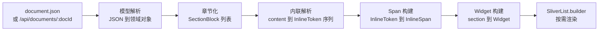

# 渲染层实现说明

## 文档信息

| 项目         | 内容                                                          |
| ------------ | ------------------------------------------------------------- |
| **文档标题** | 渲染层实现说明（Document sections 到原生 Flutter）              |
| **文档版本** | v1.0                                                          |
| **创建日期** | 2026-09-01                                                    |
| **更新日期** | 2026-09-12                                                    |
| **文档作者** | convexwf                                                      |
| **文档类型** | 实现说明                                                      |
| **参考资料** | `android-reader-design.md`、`knowledge-suite` 的 `reader-renderer.ts` 与 `parser.ts` |

## 目录

- [1 目标与范围](#1-目标与范围)
  - [1.1 目标](#11-目标)
  - [1.2 非目标](#12-非目标)
- [2 输入数据](#2-输入数据)
  - [2.1 文档模型](#21-文档模型)
  - [2.2 内联字段清单](#22-内联字段清单)
- [3 渲染管线](#3-渲染管线)
  - [3.1 总体流程](#31-总体流程)
  - [3.2 阶段职责与线程边界](#32-阶段职责与线程边界)
  - [3.3 核心数据结构](#33-核心数据结构)
- [4 内联语法规范](#4-内联语法规范)
  - [4.1 规范化形式](#41-规范化形式)
  - [4.2 宽容解析](#42-宽容解析)
  - [4.3 转义规则](#43-转义规则)
  - [4.4 降级与不支持](#44-降级与不支持)
  - [4.5 内容来源差异](#45-内容来源差异)
  - [4.6 已知缺陷与处理决定](#46-已知缺陷与处理决定)
- [5 解析器实现](#5-解析器实现)
  - [5.1 解析算法](#51-解析算法)
  - [5.2 与现有实现的边界对齐](#52-与现有实现的边界对齐)
  - [5.3 复杂度与防护](#53-复杂度与防护)
- [6 Block 渲染](#6-block-渲染)
  - [6.1 映射总表](#61-映射总表)
  - [6.2 heading 与锚点](#62-heading-与锚点)
  - [6.3 paragraph 与 blockquote](#63-paragraph-与-blockquote)
  - [6.4 list](#64-list)
  - [6.5 table](#65-table)
  - [6.6 code](#66-code)
  - [6.7 figure 与资源](#67-figure-与资源)
  - [6.8 未知类型降级](#68-未知类型降级)
- [7 资源与链接](#7-资源与链接)
- [8 性能](#8-性能)
- [9 测试](#9-测试)
- [10 与其它渲染端的一致性](#10-与其它渲染端的一致性)
- [附录 A 内联语料格式](#附录-a-内联语料格式)

## 1 目标与范围

### 1.1 目标

渲染层的唯一职责，是把服务端的 `KnowledgeDocument` 转成 Flutter widget 树，并保证同一份数据在不同设备、不同字号下的呈现稳定。

- 输入是文档 JSON 的 `sections` 数组与元信息，不是 HTML，也不是 Markdown 全文。
- 输出是可以在 `SliverList` 中按需构建的 widget，每个 section 一个构建单元。
- 内联标记的解析规则必须与服务端产出和 web 端渲染保持一致，规则以第 4 章为准。
- 每个 section 保留可定位标识（`section_id` 或生成标识），供目录跳转、阅读进度与后续注解使用。

### 1.2 非目标

- 不渲染原始 HTML 快照（`rawdoc` 与 `html` 字段不参与渲染）。
- 不使用 WebView，也不嵌入浏览器渲染引擎。
- 不把 `markdown` 端点返回的 Markdown 作为正文来源；Markdown 只用于复制与分享。
- 不在 v1 支持注解高亮叠加（结构上通过 `section_id` 为后续版本留出定位能力即可）。

## 2 输入数据

### 2.1 文档模型

渲染输入是 `KnowledgeDocument`：

```
KnowledgeDocument
├── doc_id
├── meta        # title、source、authors、language、statistics、cover_asset_id
├── references  # 引用条目（可选）
└── sections[]  # 渲染主体
```

每个 section 是一个内容块，`type` 决定渲染方式：

| `type`       | 语义     | 关键字段                                     |
| ------------ | -------- | -------------------------------------------- |
| `heading`    | 标题     | `level`、`content`、`anchor_id`               |
| `paragraph`  | 段落     | `content`                                     |
| `blockquote` | 引用     | `content`                                     |
| `list`       | 列表     | `items`（string 或 `{ text, items }`）        |
| `table`      | 表格     | `rows`（二维数组）、`content`（降级文本）      |
| `code`       | 代码块   | `content`、`language`                          |
| `figure`     | 图与图注 | `assets[]`、`content`                          |

### 2.2 内联字段清单

以下字段的取值是内联标记文本，必须经过第 4、5 章的解析后才能渲染：

| 字段                     | 出现位置                                  |
| ------------------------ | ----------------------------------------- |
| `section.content`        | heading、paragraph、blockquote、code、figure |
| `section.items[].text`   | list（含嵌套层级）                          |
| `section.items[]` 字符串项 | list                                       |
| `section.rows[][]`       | table 单元格                                |

`code` 类型的 `content` 是例外：它是原始代码文本，不做内联解析。

## 3 渲染管线

### 3.1 总体流程



### 3.2 阶段职责与线程边界

| 阶段     | 职责                                                     | 执行线程                    |
| -------- | -------------------------------------------------------- | --------------------------- |
| 模型解析 | JSON 解码、字段映射、`sections` 完整性检查                 | 后台 isolate                |
| 章节化   | 计算 heading 层级树、section 索引、锚点标识                 | 后台 isolate                |
| 内联解析 | `content` 等字段解析为 `InlineToken` 序列                   | 后台 isolate（随章节化一并） |
| Span 构建 | `InlineToken` 转 `InlineSpan`，依赖 `TextStyle` 与字号      | 主 isolate（依赖主题）       |
| Widget 构建 | 组装 block widget，处理交互与跳转                        | 主 isolate                  |

章节化与内联解析都只依赖文档数据，不依赖主题，因此放在后台 isolate 完成；`InlineSpan` 的构建依赖字号与颜色，保留在主 isolate，并在同一 section 内缓存。

### 3.3 核心数据结构

| 结构            | 用途                                                             |
| --------------- | ---------------------------------------------------------------- |
| `DocumentModel` | 文档元信息、章节树、`sectionId` 到索引的映射                        |
| `SectionBlock`  | 单个 section 的原始数据加派生数据（索引、锚点、所属标题路径）        |
| `InlineToken`   | 内联解析结果：`text`、`code`、`strong`、`em`、`del`、`link`、`math`、`break` |
| `HeadingNode`   | 目录树节点：`level`、`title`、`sectionId`、`children`               |

## 4 内联语法规范

内联语法是本层唯一的对外契约。**契约以"规范化形式"为准**：服务端只产出规范化写法，客户端解析时额外接受若干等价写法作为兼容层。规范化形式是 CommonMark 内联语法的子集，另加一个数学扩展。

### 4.1 规范化形式

服务端产出、客户端必须正确渲染的写法：

| 语义     | 规范化写法      | 示例              | 约束                                                       |
| -------- | --------------- | ----------------- | ---------------------------------------------------------- |
| 加粗     | `**text**`      | `**重点**`        | 内容中不得出现未转义的 `**`                                  |
| 斜体     | `_text_`        | `_强调_`          | 统一用下划线，不使用 `*`                                     |
| 行内代码 | 反引号包裹       | `` `value` ``     | 内容中的反引号转义为 `\``                                    |
| 链接     | `[label](href)` | `[文档](https://…)` | label 中的 `[` 与 `]` 需转义；href 必须是绝对 URL           |
| 行内数学 | `$tex$`         | `$a^2+b^2$`       | 内容中不含换行                                              |
| 软换行   | `\n`            | 段落内的换行       | 由原始 `<br>` 转换而来                                      |
| 图片     | 不产生          | —                 | 图片一律走 `figure` section，不写在段落文本里                |

服务端不产出的写法：删除线 `~~`、引用式链接、脚注、任意 HTML 标签、任务列表。

### 4.2 宽容解析

历史数据与 Markdown 导入通道会带来规范化形式之外的写法，客户端必须接受以下等价写法，否则会出现"正文显示原始符号"的问题：

| 额外接受的写法            | 等价语义                     |
| ------------------------- | ---------------------------- |
| `*text*`                  | 与 `_text_` 等价（斜体）      |
| `__text__`                | 与 `**text**` 等价（加粗）    |
| `***text***`、`___text___` | 加粗加斜体                   |
| `~~text~~`                | 删除线                        |
| 裸 `http(s)://` URL        | 自动识别为链接（autolink）     |
| ``             | 行内图片，降级规则见第 4.4 节  |
| 反斜杠转义序列             | 还原为字面字符                |

语法形式与实际产出的对应关系：

| 写法来源             | 是否保证出现 | 客户端处理方式        |
| -------------------- | ------------ | --------------------- |
| 规范化形式           | 是           | 完整支持              |
| 宽容写法             | 可能         | 等价支持              |
| 其它 Markdown 扩展   | 可能         | 降级为纯文本          |

### 4.3 转义规则

反斜杠转义的字符集合，与 web 端现有实现保持一致：

```
\  `  *  _  {  }  [  ]  (  )  #  +  -  .  !  |  ~  <  >  $  \ 
```

解析顺序固定为：

1. 结构标记扫描：行内代码、图片、链接、行内数学。这些标记优先于强调标记。
2. 文本片段中的强调匹配：按 `***`、`___`、`**`、`__`、`*`、`_`、`~~` 的顺序尝试。
3. 反转义：把 `\x` 还原为字面字符 `x`。

强调标记内部不再递归解析结构标记，只允许一层强调；这样可避免 `**a _b_ c**` 这类嵌套产生歧义，也与 web 端现有行为一致。

### 4.4 降级与不支持

| 输入情形                        | 渲染行为                                                        |
| ------------------------------- | --------------------------------------------------------------- |
| 段落中出现 ``         | 渲染为行内图片，宽度不超过可用宽度，图注使用 alt 文本             |
| 出现 `$$…$$` 块级数学            | 渲染为独立等宽数学块（跨行的 `$$` 需被识别为块级，见第 4.6 节 D1） |
| 出现 HTML 标签                   | 按纯文本显示，不解析、不执行                                      |
| 出现引用式链接 `[a][b]`           | 按纯文本显示                                                      |
| 出现表格、脚注、任务列表等扩展语法  | 按纯文本显示                                                      |
| 链接 URL 协议不在白名单内          | 渲染为普通文本，不生成可点击链接                                   |

链接协议白名单：`http`、`https`、`mailto`，以及站内锚点 `#…`。图片协议白名单：`http`、`https`。

### 4.5 内容来源差异

`section.content` 由服务端不同导入通道产出，各通道当前产出并不一致。本表描述规范目标与各通道的差距，供服务端改造时对齐。

| 通道              | 当前产出                                                          | 规范目标                       |
| ----------------- | ----------------------------------------------------------------- | ------------------------------ |
| HTML 抓取（站点适配器与 DOM 回退路径） | `[label](href)`、``、`` `code` ``、`**bold**`、`_em_`、`\n`；数学见下方说明 | 作为规范化形式的基线 |
| HTML 抓取（defuddle 路径，默认选中） | 文本、链接、强调与代码正常；数学被破坏（行内退化、块级丢失） | 修复后与规范形式一致 |
| EPUB 导入         | 纯文本（强调、链接、代码、数学在转换时被拍平）                      | 补齐规范化形式的内联标记        |
| Markdown 导入     | 原样透传 Markdown 源码，可能是任意 CommonMark 写法                  | 归一为规范化形式               |

数学在 defuddle 路径上的具体表现：defuddle 会重写 `<math>`，删除 `annotation[encoding="application/x-tex"]` 的 `encoding` 属性，并把 TeX 放进 `data-latex` 属性。服务端 `mathText()` 只识别 `encoding` 与 `alttext`，因此取不到 TeX，行内数学退化为拼接子节点文本（注解文本加 `mi`/`mo`/`mi` 文本，出现重复），独立块级公式则因选择器不含 `math` 而整段丢失。证据见 fixture `math-inline-and-display` 与第 4.6 节。

以上差异都属于服务端解析器的问题，客户端不为此分叉渲染逻辑；客户端只按第 4.2 节的宽容规则覆盖常见写法。

### 4.6 已知缺陷与处理决定

| 编号 | 现象                              | 起因                                                                   | 处理决定                                                                 |
| ---- | --------------------------------- | ---------------------------------------------------------------------- | ------------------------------------------------------------------------ |
| D1   | 行内数学退化为纯文本且内容重复       | defuddle 重写 `<math>`：删除 `annotation[encoding="application/x-tex"]` 的 `encoding`，把 TeX 放进 `data-latex`；`mathText()` 只识别 `encoding` 与 `alttext`，取不到 TeX 后回退为拼接子节点文本 | 服务端优先读取 `data-latex`；修复前客户端按纯文本渲染 |
| D2   | 独立块级公式整段丢失                | `SECTION_NODE_SELECTOR` 不含 `math`，块级 `<math display="block">` 不会被遍历成 section | 服务端把块级数学产出为独立 section；客户端按块级数学块渲染 |
| D3   | 段落内嵌块级公式变成跨行文本         | 现实现把 display math 渲染为 `\n$$\n…\n$$\n` 字符串拼进所在段的 `content` | 与 D2 一并改为独立 section；过渡期客户端识别 `$$` 包块并渲染为独立数学块 |
| D4   | 段落内图片渲染成 `!` 加一个链接      | `` 中的 `[alt](url)` 被链接规则先命中                          | 解析器按"图片先于链接"的顺序匹配                                          |
| D5   | EPUB 书籍正文没有可点击链接          | EPUB 通道在转换时丢弃链接与强调                                          | 服务端修复；客户端不针对来源类型做特殊处理                                 |
| D6   | 嵌套强调渲染破损                    | 服务端未转义内容中的 `**` 与 `_`                                          | 客户端限制一层强调；服务端在产出时补转义                                   |
| D7   | 转义字符在 web 端又被解析成标记      | web 渲染先反转义再跑强调匹配，`\_literal\_` 会变成斜体                      | 按第 4.3 节，转义必须是权威的：Android 端在扫描阶段就把转义字符落成文本，不再参与强调匹配；web 端后续按同一规则修正 |

D1 到 D3 由 fixture `math-inline-and-display` 固定为回归基线：该用例当前断言的是"缺陷现状"，服务端修复数学产出后必须同步重新生成期望文件，并同步更新本节与第 4.1 节。

规范或语料发生变更时，顺序固定为：先更新本章与共享语料（第 9 章），再改两端实现。

## 5 解析器实现

### 5.1 解析算法

解析器是一次前向扫描，把字符串切成 `InlineToken` 序列，再对纯文本片段做强调匹配。不使用嵌套正则，避免回溯风险。

```dart
List<InlineToken> parseInline(String text) {
  final tokens = <InlineToken>[];
  final buffer = StringBuffer();
  var i = 0;

  while (i < text.length) {
    final ch = text[i];

    // 1. 转义序列优先，保证被转义的标记不被当作结构标记
    if (ch == '\\' && i + 1 < text.length && escapable.contains(text[i + 1])) {
      buffer.write(text[i + 1]);
      i += 2;
      continue;
    }

    // 2. 行内代码：反引号包裹，内部不再解析
    if (ch == '`') {
      final end = text.indexOf('`', i + 1);
      if (end > i) {
        flushText(buffer, tokens);
        tokens.add(InlineToken.code(text.substring(i + 1, end)));
        i = end + 1;
        continue;
      }
    }

    // 3. 图片先于链接匹配，避免  被拆成 "!" 加链接
    if (text.startsWith('![', i)) {
      final link = tryParseLinkLike(text, i + 1);
      if (link != null) {
        flushText(buffer, tokens);
        tokens.add(InlineToken.inlineImage(alt: link.label, src: link.href));
        i = link.end;
        continue;
      }
    }

    // 4. 链接
    if (ch == '[') {
      final link = tryParseLinkLike(text, i);
      if (link != null) {
        flushText(buffer, tokens);
        tokens.add(InlineToken.link(label: link.label, href: link.href));
        i = link.end;
        continue;
      }
    }

    // 5. 行内数学：单行，遇到换行结束
    if (ch == r'$') {
      final end = text.indexOf(r'$', i + 1);
      final newline = text.indexOf('\n', i + 1);
      if (end > i && (newline == -1 || end < newline)) {
        flushText(buffer, tokens);
        tokens.add(InlineToken.math(text.substring(i + 1, end)));
        i = end + 1;
        continue;
      }
    }

    // 6. 换行
    if (ch == '\n') {
      flushText(buffer, tokens);
      tokens.add(const InlineToken.softBreak());
      i += 1;
      continue;
    }

    buffer.write(ch);
    i += 1;
  }

  flushText(buffer, tokens);
  return applyTextEmphasisAndAutolink(tokens);
}
```

约定：

- `tryParseLinkLike` 要求 `label` 与 `href` 成对出现，`href` 通过协议白名单校验；不合法时返回 `null`，由调用方按普通文本处理。
- `flushText` 产出的文本片段先做 autolink 切分，再做强调匹配；两者都只在文本片段内生效，不跨越其它 token。
- 代码块内不解析任何标记，因此 `code` 类型 section 直接走等宽文本渲染，不调用本函数。

### 5.2 与现有实现的边界对齐

以下规则必须与 web 端 `reader-renderer.ts` 的现有行为一致，否则同一篇文档在两端呈现不同：

| 规则             | 行为                                                                 |
| ---------------- | -------------------------------------------------------------------- |
| heading 锚点      | 优先使用 `anchor_id`，缺失时用下面的 `slugify` 生成                   |
| 文档标题          | 作为 level 1 标题渲染，使用索引 0                                      |
| 链接 label        | label 内部可以再包含强调标记，按同一规则递归解析                        |
| label 转义        | 服务端把 label 中的 `[`、`]` 转义为 `\[`、`\]`，客户端反转义后显示字面 |
| 行内数学          | 只识别单行 `$…$`，跨行的 `$` 不构成数学                                |
| autolink          | 匹配 `http(s)://` 起始的连续非空白串，并去掉尾部的 `.,;:!?)`           |
| 公式文字          | v1 以等宽文本呈现，不引入公式排版引擎                                   |

`slugify` 的实现逐字符对齐 web 端：

```dart
String slugify(String text, int index) {
  final normalized = text
      .toLowerCase()
      .replaceAll(RegExp(r'[^\p{L}\p{N}\s-]', unicode: true), '')
      .trim()
      .replaceAll(RegExp(r'\s+'), '-');
  return normalized.isEmpty ? 'section-$index' : '$normalized-$index';
}
```

有一个有意保留的偏差：CommonMark 规定 `_` 在词内不产生强调，本层不实现该限制。原因是规范化形式中 `_` 只用于强调，`snake_case` 这类裸下划线应由产出端转义（见第 4.6 节 D4）。这条偏差在两端一致，不影响一致性目标。

### 5.3 复杂度与防护

| 项         | 策略                                                                       |
| ---------- | -------------------------------------------------------------------------- |
| 时间复杂度 | 单遍扫描 O(n)；强调匹配只在文本片段内进行，片段之间不重叠                     |
| 正则使用   | 只使用无嵌套量词的模式；链接、代码、数学由手写扫描完成                        |
| 长度上限   | 单个 `content` 超过 200 KB 时整段按纯文本渲染，并记录一次诊断                 |
| Token 上限 | 单段 token 数超过 5000 时截断渲染，并记录一次诊断                             |
| 嵌套深度   | 强调最多一层；链接 label 内不再嵌套链接                                       |
| 失败策略   | 任何解析异常都回退为"整段纯文本"，不允许抛异常中断文档渲染                     |

## 6 Block 渲染

### 6.1 映射总表

| `type`       | 渲染单元                                            | 关键实现                                                     |
| ------------ | --------------------------------------------------- | ------------------------------------------------------------ |
| `heading`    | `Text.rich`，按 `level` 取样式                       | 生成锚点标识，进入章节树                                       |
| `paragraph`  | `Text.rich`                                          | 解析内联标记；行距与段间距由阅读设置控制                        |
| `blockquote` | `Container` 左边框装饰加内层 `Text.rich`             | 背景与边框取自主题                                             |
| `list`       | `Column` 加每项 `Row`（符号列加内容列）               | 支持 `items[].items` 的嵌套层级                                |
| `table`      | 横向 `SingleChildScrollView` 包裹 `Table`            | 首行作为表头；单元格内容解析内联标记                            |
| `code`       | 横向 `SingleChildScrollView` 包裹 `SelectableText`   | 等宽字体；`language` 作为角标；v1 不做语法高亮                  |
| `figure`     | `Column`：图片加图注加可选段落                        | `assets[]` 逐项渲染；`content` 作为图后段落                     |

列表没有 `ordered` 字段：服务端在解析阶段未保留有序性，v1 统一按无序列表渲染，与 web 端一致。该限制记录在第 4.6 节同级的服务端待办中。

### 6.2 heading 与锚点

- 层级：`level` 取值 1 到 6，映射到字号与字重，字号随阅读设置的字号缩放。
- 锚点：优先 `anchor_id`；缺失时调用 `slugify(content, headingIndex)`，`headingIndex` 从 1 开始按文档顺序递增。
- 文档标题：由 `meta.title` 生成一个 level 1 标题，索引为 0，置于 `sections` 之前。
- 章节树：按 web 端同款栈式算法构建，遇到 `level` 不小于栈顶的节点时弹栈，得到嵌套结构。章节树用于目录面板与进度定位。

### 6.3 paragraph 与 blockquote

- 段落使用 `Text.rich`，`TextSpan` 由内联 token 构建；`softBreak` 渲染为换行而不是新段落。
- 段落文本可选择复制：v1 使用 `SelectionArea` 包裹正文，避免为每段引入独立控制器。
- blockquote 使用带左侧竖线的容器，内层仍是 `Text.rich`，保持与段落一致的排版参数。

### 6.4 list

- `items` 的元素有两种形态：字符串，或 `{ text, items }` 对象。
- 每一项渲染为一行：左侧符号列（无序列表统一使用圆点），右侧内容列解析内联标记。
- 嵌套层级通过缩进表示，缩进步长随字号缩放；嵌套深度超过 5 层时不再继续缩进，避免窄屏内容过窄。

### 6.5 table

- `rows` 为二维数组，第一行渲染为表头，其余行为数据行。
- 整表横向滚动，列宽按内容自适应，并设定最小列宽，避免单字符列过窄。
- 单元格文本解析内联标记，保持与段落一致的样式。
- 若 `rows` 为空而 `content` 非空，按段落渲染 `content`。

### 6.6 code

- `content` 原样渲染，不做内联解析，保留缩进与换行。
- 使用等宽字体，横向滚动避免折行破坏代码结构。
- `language` 存在时在代码块右上角显示语言标签；v1 不做语法高亮，后续可评估引入高亮库。

### 6.7 figure 与资源

- 遍历 `assets`，每项渲染一张图片加图注。图片地址按优先级选择：`path`（形如 `assets/<assetId>`）优先，其次 `source_url`。
- 图注使用 `alt` 或 `caption`，两者都为空时不渲染图注。
- `figure` 的 `content` 非空时，作为图片之后的段落渲染。
- 图片加载失败时渲染占位块并显示 alt 文本，不抛出异常。

### 6.8 未知类型降级

遇到未知 `type`，按段落渲染其 `content`；`content` 也为空时跳过该 section，并记录一次诊断，保证文档其余部分正常显示。

## 7 资源与链接

### 7.1 资源地址解析

section 中的图片引用有两种形态：包内相对路径 `assets/<assetId>`，以及外部绝对 URL。解析顺序：

| 顺序 | 条件                                   | 结果                                                     |
| ---- | -------------------------------------- | -------------------------------------------------------- |
| 1    | 形如 `assets/<assetId>` 且本地文件存在  | 使用本地文件                                              |
| 2    | 形如 `assets/<assetId>` 但本地不存在    | 回退在线 `/api/assets/<assetId>`（需要网络与 token）       |
| 3    | 绝对 URL 且协议为 `http`/`https`        | 直接加载，失败时渲染占位                                   |
| 4    | 其它                                   | 不加载，渲染占位与 alt 文本                                |

在线兜底只在文档已联网时尝试，离线状态下直接进入占位，避免长时间等待连接超时。

### 7.2 图片加载与缓存

- 本地图片使用 `Image.file`，并通过 `cacheWidth` 限制解码宽度（按设备物理宽度乘以缩放系数），避免大图整幅解码。
- 远程图片使用带缓存的图片组件，缓存键为 URL，缓存目录位于应用私有目录。
- 图片加载失败时渲染固定高度的占位容器并显示 alt 文本，保证段落高度稳定，滚动时不跳动。
- 图注文本与正文同样支持内联标记（若 `caption` 包含标记）。

### 7.3 链接行为

| 链接形态                | 行为                                                       |
| ----------------------- | ---------------------------------------------------------- |
| `#anchor`               | 在当前文档内跳转到对应 heading 锚点，找不到时提示并停留在原位 |
| `http` / `https`        | 经 `url_launcher` 交给系统浏览器打开                        |
| `mailto`                | 交给系统邮件客户端                                          |
| 其它协议或不合法 URL     | 渲染为普通文本，不可点击                                    |

长按链接展示目标地址，避免误触跳转。

## 8 性能

| 关注点       | 做法                                                                     |
| ------------ | ------------------------------------------------------------------------ |
| 文档解析     | 在后台 isolate 完成 JSON 解码、章节化与内联解析，主 isolate 不承担解析耗时   |
| 构建策略     | 正文使用 `SliverList.builder`，只构建可见区附近的 section                  |
| Span 复用    | 同一 section 的 `InlineSpan` 按当前字号与主题缓存，滚动回来不重复解析与构建  |
| 图片解码     | 限制 `cacheWidth`，列表外图片不预解码                                      |
| 目录跳转     | 使用按 index 定位的列表组件，避免遍历计算高度                              |
| 段落选择     | 使用 `SelectionArea` 统一处理，避免为每段创建独立的选择控制器                |
| 大文档       | `meta.statistics.sectionCount` 超过阈值时启用分块构建与诊断日志             |

目标：200 sections 的文档打开小于 300 ms，2 MB 文档小于 1.5 s，滚动稳定 60 fps，目录跳转小于 300 ms。指标与验收口径见 `android-reader-design.md` 第 12 章。

## 9 测试

### 9.1 共享内联语料

内联解析是两端最容易漂移的部分，因此用同一份语料约束 TypeScript 与 Dart 实现。

| 项       | 位置                                                             |
| -------- | ---------------------------------------------------------------- |
| 语料文件 | `knowledge_reader/test/fixtures/inline/inline-spec.json`（Dart 侧执行） |
| 镜像副本 | `knowledge-suite/apps/knowledge-web-clipper/tests/fixtures/inline-spec.json`（TS 侧执行） |
| 版本字段 | 文件内 `specVersion`，与本文档第 4 章的规则集对应                   |

两份文件内容保持同构，各自在本仓库内被测试读取；`specVersion` 不一致时测试失败。若后续出现同步成本，可改为单一来源加同步脚本。

语料格式见[附录 A](#附录-a-内联语料格式)。

### 9.2 渲染测试

| 类型   | 覆盖内容                                                                   |
| ------ | -------------------------------------------------------------------------- |
| 单元   | 内联语料逐条断言；`slugify`；章节树构建；进度定位降级逻辑                     |
| Golden | 7 种 block 的代表性样例，覆盖浅色与深色主题、两种字号                          |
| Widget | 目录跳转、进度恢复、图片失败占位、未知 section 类型降级                        |
| 性能   | 大文档打开耗时与滚动帧率，作为回归基线                                        |

### 9.3 边界用例清单

以下用例必须在语料或测试中出现，用于防止历史缺陷回归：

| 用例                                       | 期望                                                |
| ------------------------------------------ | --------------------------------------------------- |
| `` 出现在段落中      | 渲染为行内图片，且不出现多余的 `!`                    |
| `\n$$\nx=1\n$$\n` 出现在内容中              | 渲染为独立数学块，不显示字面 `$$`（服务端修复 D1 到 D3 前不会产出该输入，用例用于约束渲染实现） |
| `` `a**b**c` ``                            | 反引号内不解析强调                                    |
| `**a _b_ c**`                              | 一层强调内不再嵌套解析                                |
| `\_literal\_`                              | 显示字面下划线，不产生斜体                            |
| `见 https://example.com/a。`                | autolink 不吞掉尾部中文标点                            |
| `[a](javascript:alert(1))`                 | 不生成链接，按纯文本显示                              |
| `assets/missing.png` 本地不存在             | 渲染占位，正文其余部分正常                             |

## 10 与其它渲染端的一致性

当前存在两个渲染端：web 阅读器（`reader-renderer.ts`）与本客户端。两端服务同一份 `sections` 数据，因此规则必须一致，不一致点需要显式记录。

| 规则来源             | 状态                                                         |
| -------------------- | ------------------------------------------------------------ |
| 第 4.1 节规范化形式   | 以服务端产出为准，两端都必须正确渲染                           |
| 第 4.2 节宽容写法     | 两端都必须接受，避免历史数据在任一端显示原始符号                |
| 第 4.6 节缺陷处理     | 客户端先按决定实现；服务端修复后两端同步简化                    |
| 排版与主题            | 各自平台独立，不要求一致                                        |

变更流程固定为三步：更新本文档第 4 章与共享语料，更新服务端产出规则，更新两端实现。任何一端单独放宽解析规则都会破坏一致性目标。

## 附录 A 内联语料格式

语料文件是一个 JSON 对象，包含版本号与用例数组：

```json
{
  "specVersion": 1,
  "cases": [
    {
      "name": "bold",
      "input": "a **b** c",
      "tokens": [
        { "type": "text", "value": "a " },
        { "type": "strong", "children": [{ "type": "text", "value": "b" }] },
        { "type": "text", "value": " c" }
      ]
    },
    {
      "name": "link-with-emphasis",
      "input": "[see _this_](https://example.com)",
      "tokens": [
        {
          "type": "link",
          "href": "https://example.com",
          "children": [
            { "type": "text", "value": "see " },
            { "type": "em", "children": [{ "type": "text", "value": "this" }] }
          ]
        }
      ]
    }
  ]
}
```

Token 类型与字段：

| `type`       | 字段                                                     |
| ------------ | -------------------------------------------------------- |
| `text`       | `value`                                                  |
| `strong`     | `children`                                               |
| `em`         | `children`                                               |
| `del`        | `children`                                               |
| `code`       | `value`                                                  |
| `link`       | `href`、`children`                                        |
| `inline_image` | `src`、`alt`                                            |
| `math`       | `value`                                                  |
| `soft_break` | 无                                                       |

断言方式：两端各自实现"输入字符串到 token 序列"的解析函数，测试逐条比较解析结果与 `tokens` 字段。渲染层其余测试（golden、widget）建立在这层解析结果之上，因此只要语料通过，两端的内联行为就保持一致。
